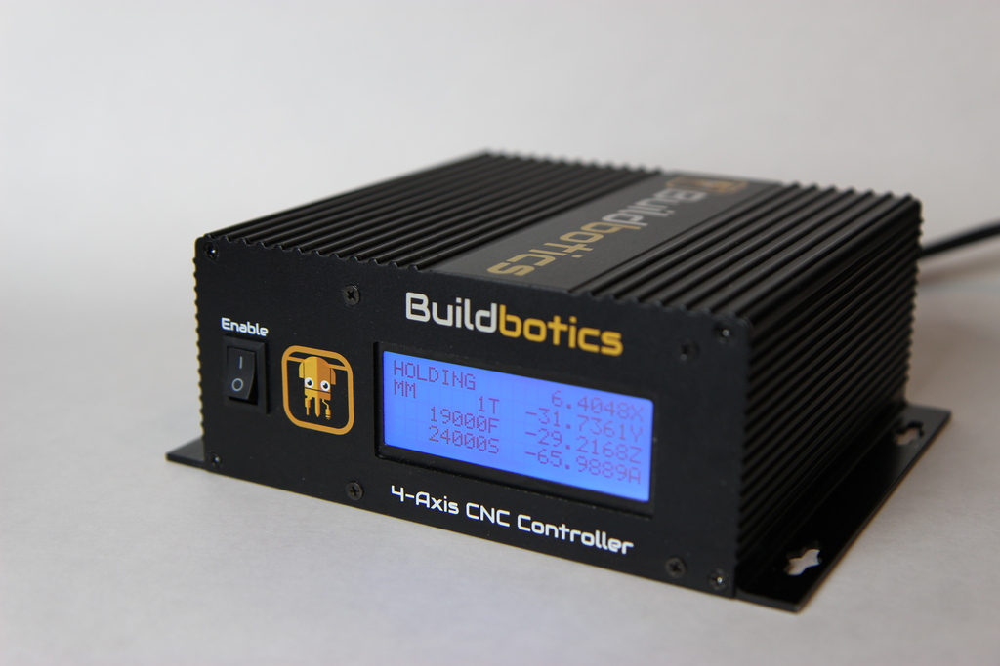
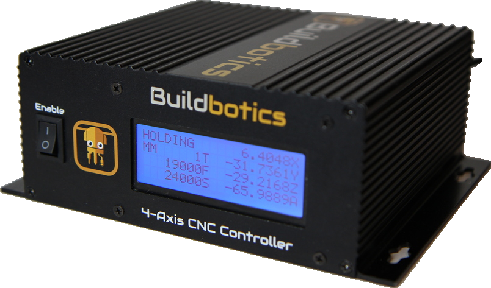

# grabcut

A simple program for interactively removing the background from an image using
the grab cut algorithm and OpenCV.

This code was derived from the Grab Cut example from the OpenCV project.

## Example

## Usage
    grabcut.py <input> [output]

## Operation

At startup, two windows will appear, one for input and one for output.

To start, in input window, draw a rectangle around the object using mouse right
button.  For finer touch-ups, press any of the keys below and draw circles on
the areas you want.  Finally, press 's' to save the result.

## Keys
  * 0 - Select areas of sure background
  * 1 - Select areas of sure foreground
  * 2 - Select areas of probable background
  * 3 - Select areas of probable foreground
  * n - Update the segmentation
  * r - Reset the setup
  * s - Save the result
  * q - Quit
